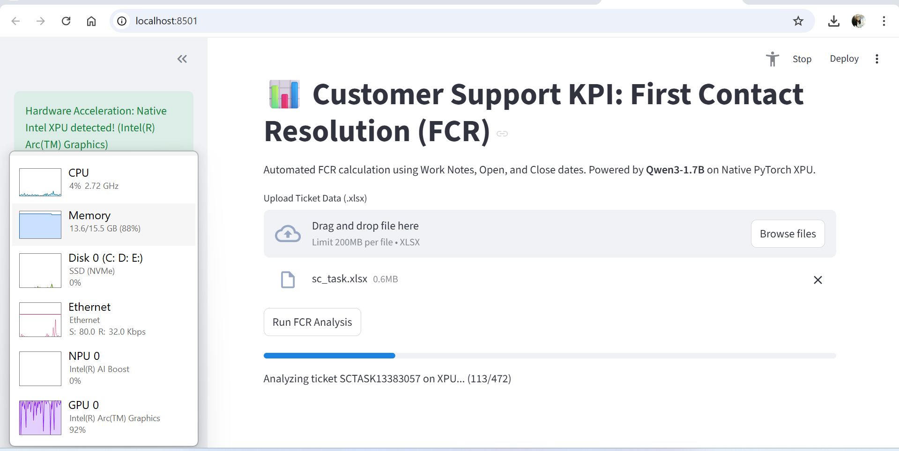

# 📊 FCR Rate Dashboard

An automated Customer Support KPI dashboard that calculates the **First Contact Resolution (FCR)** rate. It uses an LLM running *natively* on an **Intel XPU** via PyTorch to read ticket work notes, determine if an issue was resolved in a single interaction, and visualize the performance against a 70% target.

## ✨ Features
* **Native Intel XPU Acceleration:** Uses PyTorch's native XPU backend (no `ipex` required) for blazing-fast local inference.
* **Local LLM Powered:** Integrates Hugging Face's `Qwen/Qwen4-7B-Instruct` to intelligently classify ticket resolution status.
* **Interactive UI:** Built with Streamlit and Plotly for an easy-to-use, drag-and-drop dashboard experience.
* **One-Click Export:** Download the analyzed and categorized Excel report instantly.

## 📋 Prerequisites
* **Hardware:** Intel GPU / XPU (e.g., Intel Arc GPU or Intel Data Center GPU Max).
* **Environment:** Python 3.10+
* **Data:** An `.xlsx` file containing at least two columns: `Ticket ID` and `Work Notes`.

## ⚙️ Installation

1. **Install Native PyTorch for XPU:**
   ```bash
   uv add torch torchvision torchaudio --index-url https://download.pytorch.org/whl/xpu
   ```

2. **Install Required Dependencies:**
   ```bash
   uv add transformers pandas openpyxl streamlit plotly
   ```

## 🚀 Usage

1. Save the application code as `app.py`.
2. Run the Streamlit dashboard:
   ```bash
   uv run streamlit run app.py
   ```
3. Open the local URL provided in your terminal (usually `http://localhost:8501`).
4. **Upload your `.xlsx` file** and click **"Run FCR Analysis"**.
5. View your real-time FCR gauge chart and download the updated report! 

## UI & XPU Usage

